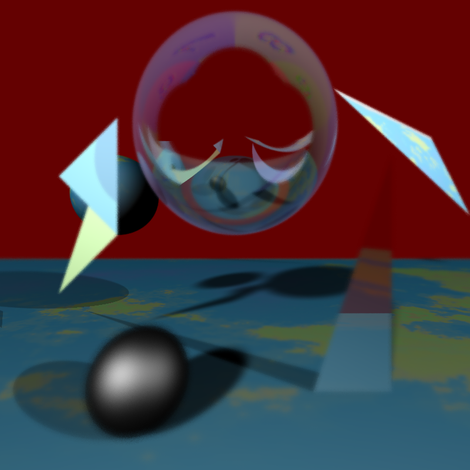
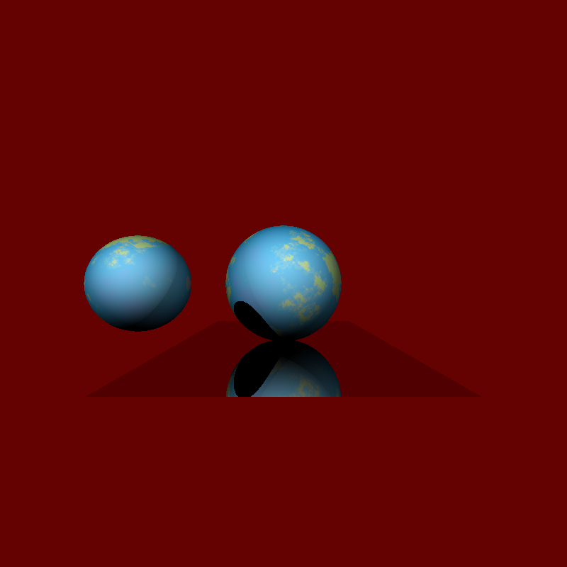
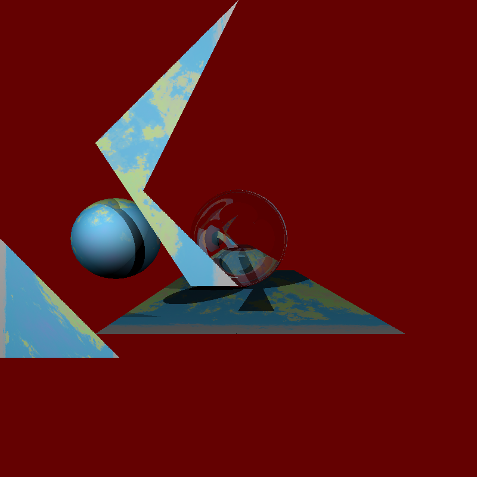

#
# Computer Graphics, Autumn 2019
#

This is the code for a full ray tracer for which I receieved a 95% grade, built upon the template code supplied for the 2nd assignment of the Computer Graphics course, Autumn 2019, at the University of Edinburgh.

# Features 

* Basic Ray Tracing
* Point Lightsources 
* Area Lightsources (Soft Shadows)
* Varying shapes:
  * Spheres
  * Planar Quads
  * Triangles
  * TriMeshes
* Texture Mapping For Each Shape
* Reflections
* Refraction
* Bounding Volume Hierarchy (BVH)
* Pinhole Camera
* Thin Lens Camera (Depth of Field)

# Example Images

# How to Build and Run

Example code for the provided libraries can be found in the examples/ folder, along with an example input file example.json.

The skeleton of the main() function has already been defined, as well as some inheritance examples of the Camera class and its subclasses, and the Sphere class, as a child of the Shape class,  but you can add or modify the functions used, as long as the class structure is respected.

To compile the code:

cd path/to/RayTracer
mkdir build
cmake ..
make

This compiles both the raytracer and the example programs, executables of which can be found in build/ folder.

To run the examples, do:

1. for the json parsing example:

./jsonexample ../examples/example.json

2. for the vector library example:

./vectorexample

3. for the raytracer provided:

./raytracer ../examples/example.json <path_to_output_img>/testout.ppm